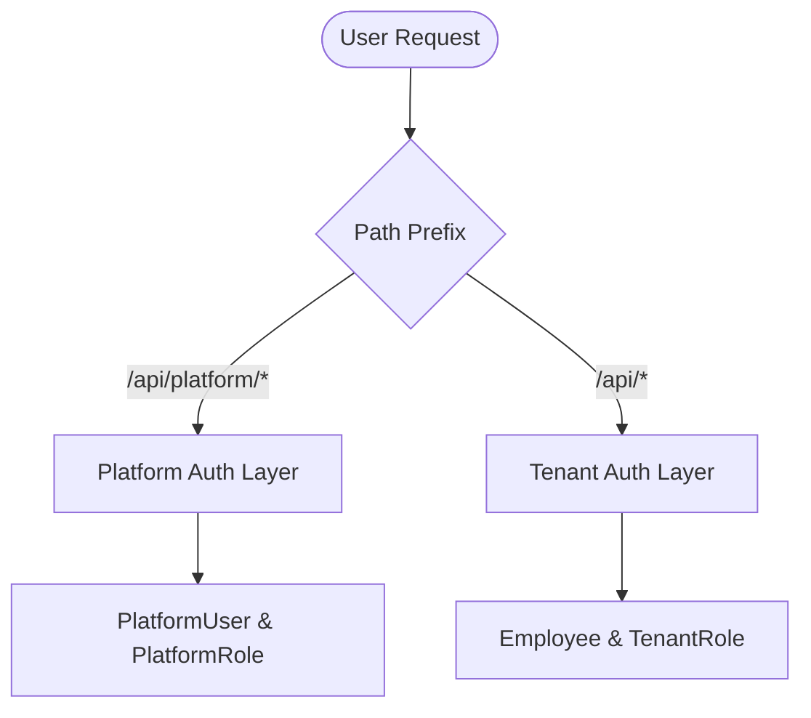
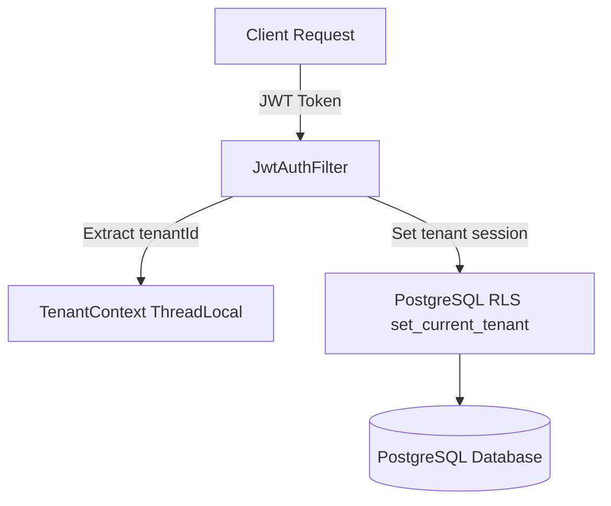

# SonixHR — Enterprise Multi-Tenant SaaS HRM Platform

SonixHR is a modern, high-performance, **multi-tenant Software-as-a-Service (SaaS) Human Resource Management (HRM) platform** built using Spring Boot 3.1.5, Java 17, and PostgreSQL. It is designed to provide secure, isolated employee management, payroll processing, attendance tracking, and task allocation for multiple organizations (tenants) under a single platform deployment.

---

## 1. Core Architecture & Design Patterns

### 🔒 Dual Authentication Contexts
SonixHR isolates security, user records, and access permissions into two distinct routing and security environments:
1. **Platform Administration Layer (`/api/platform/**`)**: Access is restricted to Platform Super Admins and Platform Staff. Authorized personnel manage subscriptions, monitor system health metrics, override tenant limits, and handle global billing.
2. **Tenant Operations Layer (`/api/**`)**: Access is restricted to the specific organization's employees (`Employee` security context). The context is isolated per tenant.



### 🧬 Tenant Isolation & Database Security (RLS)
To guarantee strict tenant data privacy, SonixHR leverages a combined application-and-database isolation design:
* **`TenantContext`**: A ThreadLocal storage context populated automatically by the `JwtAuthFilter` after extracting the `tenantId` claim from incoming JWT tokens.
* **Row Level Security (RLS)**: Interacts directly with PostgreSQL security policies. Every database transaction sets the tenant reference via the `set_current_tenant()` PostgreSQL function. PostgreSQL automatically filters queries so that a tenant cannot read or write data belonging to another tenant.



### 🛠️ Key Technical Patterns
* **DTO Flow Pattern**: API endpoints strictly exchange custom Data Transfer Objects (DTOs) rather than raw Entities. Validation is performed in the request DTOs, manual bean mappers handle safe conversion, and Lombok `@Builder` generates responses.
* **Token Blacklisting**: For secure logouts, JWT tokens are added to an in-memory blacklisting cache (`JwtService.tokenBlacklist`) until their expiration.
* **Dynamic RBAC Evaluator**: Custom method-level authorization checks are handled via `@PreAuthorize("@permissionEvaluator.hasPermission(...)")`, referencing database-backed permissions.

---

## 2. Core Modules & Feature Catalog

SonixHR is divided into modular feature suites supporting both platform-level admins and tenant-level managers and employees.

### 🌐 Platform & Tenant Lifecycle Management
* **Self-Service Registration**: Prospective organizations can register as new tenants, auto-provisioning initial configurations.
* **Branding & Customization**: Supports tenant-specific logos, branding colors, and unique portal settings.
* **Subscription & Plans**: Supports seat counts, storage limits, and feature permissions per subscription plan. Platform admins can dynamically suspend, activate, or override limits.
* **Platform Metrics Dashboard**: High-level KPIs, Monthly Recurring Revenue (MRR) tracking, tenant usage statistics, and real-time database/mail system health checks.

### 👥 HR Operations & Organization Directory
* **Hierarchical Organization**: Supports custom Departments with parent-child structures and manager reporting lines.
* **Rich Employee Profiles**: Includes personal details, contact data, reporting structure, base salary contracts, and database-level `JSONB` custom fields to accommodate organization-specific fields without schema changes.
* **Interactive Org Chart**: Computes reporting structures dynamically for an immediate organizational hierarchy preview.

### 🗓️ Consolidated Calendar, Shifts & Attendance
* **Shift Configuration**: Templates and schedules defining shift durations, check-in graces, and work-week allocations.
* **Clock-in / Clock-out Tracking**: Direct check-in/out logging with biometric device support indicators and location-based rules.
* **Overtime Requests**: Flow for requesting, calculating, and approving employee overtime hours.
* **Consolidated Calendar**: A single monthly view per employee consolidating assigned shifts, registered attendance logs, and active leave periods.

### 🏖️ Leave & Time-Off Management
* **Dynamic Leave Policies**: Settings for specifying maximum entitlements, accruals, carryforward limits, and restrictions per leave type (e.g., Sick, Casual, Earned Leave).
* **Leave Requests**: Portal for request submission, manager review (approval/rejection), cancellation, and balance updates.

### 💳 Payroll, Taxes & Payslips
* **Flexible Salary Profiles**: Configures custom allowances, deduction structures, and base wages per employee.
* **Payruns**: Automated payroll processing cycles calculating gross salary, loss of pay (LOP) deductions based on attendance, state professional tax brackets, and ESIC/Provident Fund statutory rates.
* **Payslip PDFs**: Generation of secure payslips, with download endpoints rendering printable payslip documents.

### 📋 Operational Tasks
* **Task Allocation**: Managers can assign specific actions to employees, set priorities, and track status transitions (To-Do, In-Progress, Done).

---

## 3. Technology Stack

| Component | Technical Stack Detail |
|---|---|
| **Framework** | Spring Boot 3.1.5 |
| **Language** | Java 17 |
| **Database** | PostgreSQL |
| **Migration** | Flyway (schema-migrations) |
| **Security** | Spring Security & JWT (`jjwt-api 0.11.5`) |
| **Lombok** | Lombok (Boilerplate reduction) |
| **Validation** | Jakarta Bean Validation |
| **Mailing** | Spring Boot Starter Mail |
| **Configuration** | spring-dotenv (reads `.env` configuration) |

---

## 4. Getting Started

### Prerequisites
* Java 17 JDK
* Maven 3.8+
* PostgreSQL 15+

### Database Configuration & Bootstrapping
1. Copy `.env.example` to `.env` (or create a `.env` in the root directory) and fill in the database credentials:
   ```properties
   DB_URL=jdbc:postgresql://localhost:5432/sonixhr_db
   DB_USERNAME=postgres
   DB_PASSWORD=your_secure_password
   APP_JWT_SECRET=your_super_secret_jwt_key_at_least_256_bits_long
   ```
2. The project features a pre-startup migration check inside [SonixhrApplication.java](file:///e:/Viplora/sonixhr/src/main/java/com/sonixhr/SonixhrApplication.java).
3. The database seeders (`PlatformDataInitializer`, `TenantRoleSeeder`) run automatically on startup to bootstrap default roles, plans, and the initial Platform Super Admin.

#### Default Credentials (Bootstrap)
* **Super Admin Email**: `admin@sonixhr.com`
* **Super Admin Password**: `Admin@123`

### Build and Run
Use the Maven wrappers to compile and run the application:

```bash
# Clean and compile the codebase
mvn clean install

# Run the Spring Boot application
mvn spring-boot:run
```
The server starts by default on port `8081`. 

### Further References
* Comprehensive API Catalog: Refer to [comprehensive_api_references.md](file:///e:/Viplora/sonixhr/comprehensive_api_references.md) for a list of all request/response endpoints.
* Maven Guide: Refer to [HELP.md](file:///e:/Viplora/sonixhr/HELP.md) for Maven commands and parent overrides.
