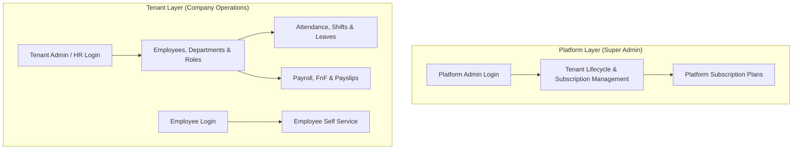
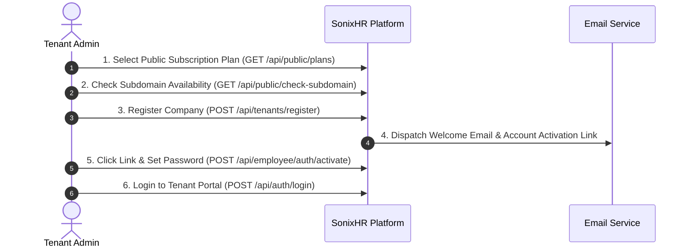
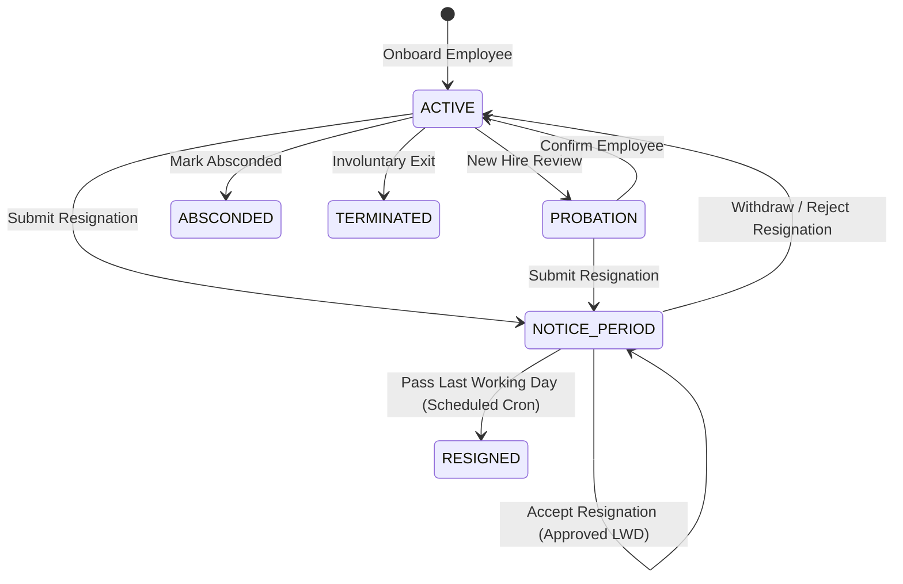

# SonixHR - Comprehensive Platform & User Manual

Welcome to the **SonixHR Platform User Manual**. This document provides an exhaustive, step-by-step guide explaining the purpose, architecture, end-to-end user workflows, features, and operational modules of SonixHR.

---

## Table of Contents

1. [Executive Overview & Platform Purpose](#1-executive-overview--platform-purpose)
2. [Security & Multi-Tenant Architecture](#2-security--multi-tenant-architecture)
3. [End-to-End Workflows & User Journeys](#3-end-to-end-workflows--user-journeys)
   - [Phase 1: Tenant Onboarding & Account Setup](#phase-1-tenant-onboarding--account-setup)
   - [Phase 2: Organization & Security Configuration](#phase-2-organization--security-configuration)
   - [Phase 3: Employee Lifecycle & Resignation Workflow](#phase-3-employee-lifecycle--resignation-workflow)
   - [Phase 4: Operational HR & Payroll Modules](#phase-4-operational-hr--payroll-modules)
   - [Phase 5: Super Admin Platform Management](#phase-5-super-admin-platform-management)
4. [Detailed Feature Guide by Module](#4-detailed-feature-guide-by-module)
5. [Role & Permission Matrix](#5-role--permission-matrix)
6. [Troubleshooting & FAQs](#6-troubleshooting--faqs)

---

## 1. Executive Overview & Platform Purpose

**SonixHR** is a modern, enterprise-grade **Multi-Tenant SaaS Human Resource Management (HRM) Platform** built to streamline human operations for growing organizations, medium-sized enterprises, and platform administrators.

### Core Objectives
- **Centralized Employee Governance**: Manage the end-to-end employee lifecycle from onboarding to full-and-final settlement.
- **Strict Multi-Tenant Isolation**: Ensure every company operates in its own isolated workspace with data confidentiality, dedicated role permissions, and customized policies.
- **Statutory Compliance & Auditability**: Maintain historical records, statutory tax regimes, attendance logs, and full-and-final payroll compliance.
- **Self-Service & Productivity**: Empower employees with self-service profile management, leave requests, task tracking, and digital payslip downloads.

---

## 2. Security & Multi-Tenant Architecture

SonixHR enforces a **dual-layer authentication and security model**:

1. **Platform Layer (`/api/platform/**`)**:
   - Managed exclusively by Super Admins (`admin@sonixhr.com`).
   - Manages tenant accounts, subscription plans, platform pricing, and audit logs.
2. **Tenant Layer (`/api/**`)**:
   - Managed by Tenant Admins, HR Managers, and Employees.
   - Enforces PostgreSQL Row-Level Security (RLS) and JWT `tenantId` token claims to guarantee that data queries never bleed across tenants.

---

## 3. End-to-End Workflows & User Journeys

### Phase 1: Tenant Onboarding & Account Setup

1. **Plan Selection**: The prospective tenant explores available subscription plans (`Trial`, `Standard`, `Enterprise`).
2. **Subdomain Verification**: Ensures the requested company code (e.g., `acmecorp.sonixhr.com`) is unique.
3. **Registration**: The tenant provides company details, admin credentials, and contact information.
4. **Activation**: The tenant admin receives an activation email with a tokenized link to set up their password.
5. **Initial Workspace Bootstrapping**: Upon first login, SonixHR automatically seeds default roles (`Tenant Admin`, `HR Manager`, `Employee`) and provisions the workspace.

---

### Phase 2: Organization & Security Configuration

Before adding employees, the Tenant Admin configures the organizational structure:

1. **Departments**: Create departments (`Engineering`, `Human Resources`, `Sales`) with unique codes and managers (`POST /api/tenant/departments`).
2. **Custom Roles & Permissions**: Define custom access levels (`POST /api/tenant/roles`) and assign fine-grained permissions (`EMPLOYEE_VIEW_ALL`, `PAYROLL_MANAGE`, etc.).
3. **Shift Configurations**: Establish working hours, grace periods, and shift schedules (`POST /api/tenant/shifts`).
4. **Payroll Configurations**: Set up salary components, statutory PF/ESI rules, and company tax settings (`POST /api/tenant/payroll/configuration`).

---

### Phase 3: Employee Lifecycle & Resignation Workflow

#### Detailed Resignation & Notice Period Steps:
1. **Resignation Submission (`POST /api/employees/{id}/resignation/submit`)**:
   - Employee or Manager submits resignation with a reason and proposed Last Working Date (LWD).
   - Employee status transitions to `NOTICE_PERIOD`. `isActive` remains `true` so system access is preserved.
2. **Resignation Review & Acceptance (`POST /api/employees/{id}/resignation/accept`)**:
   - HR/Manager accepts the resignation and approves the official LWD.
   - Resignation status updates to `APPROVED`.
3. **Resignation Withdrawal / Rejection (`POST /api/employees/{id}/resignation/withdraw`)**:
   - If withdrawn or rejected, status reverts back to `ACTIVE`, clearing notice period fields.
4. **Automated Offboarding Execution (`POST /api/employees/process-offboarding`)**:
   - A daily scheduled background job evaluates approved LWDs. When an employee's LWD passes, status flips to `RESIGNED`, `isActive` turns `false`, and access is automatically revoked.
5. **Absconding Management (`POST /api/employees/{id}/abscond`)**:
   - Marks unannounced departures as `ABSCONDED` and revokes credentials immediately.

---

### Phase 4: Operational HR & Payroll Modules

1. **Attendance & Time Management**:
   - Employees record daily check-in and check-out (`POST /api/attendance/check-in`).
   - Supports manual attendance regularization by HR (`POST /api/attendance/manual`).
2. **Leave Management**:
   - Employees check leave balances and apply for leaves (`POST /api/employee/leaves/apply`).
   - Managers review and approve/reject leave requests (`POST /api/leaves/management/{id}/approve`).
3. **Payroll & Payslip Generation**:
   - HR runs monthly payroll calculations (`POST /api/payroll/process`).
   - System calculates gross earnings, tax deductions, PF/ESI, and net pay.
   - Generates digital payslips for employees (`GET /api/payslips/me`).
4. **Full & Final Settlement (FnF)**:
   - Process final dues, encashment, and deductions for resigning employees (`POST /api/fnf/calculate`).

---

### Phase 5: Super Admin Platform Management

Super Admins access the global platform layer (`/api/platform/**`) to manage all tenants across the SaaS application:

- **Tenant Health & Suspension**: Monitor active tenants, suspend non-paying accounts (`POST /api/platform/tenants/{id}/suspend`), or lock workspaces.
- **Subscription Plans**: Create and update plans, modify pricing, and toggle features (`POST /api/platform/subscription-plans`).
- **Audit & Log Inspection**: Review global API hit logs (`GET /api/platform/api-hit-logs`) and security events.

---

## 4. Detailed Feature Guide by Module

| Module | Purpose | Key Actions & Endpoints |
| :--- | :--- | :--- |
| **Tenant Registration** | Company sign-up & subdomain verification | `POST /api/tenants/register`, `GET /api/public/check-subdomain` |
| **Tenant Auth** | Secure login & password recovery | `POST /api/auth/login`, `POST /api/auth/forgot-password` |
| **Employee Management** | Employee records, roles, & status | `POST /api/employees`, `PUT /api/employees/{id}`, `GET /api/employees` |
| **Resignation & Offboarding**| Notice period, approvals, & LWD tracking | `POST /api/employees/{id}/resignation/submit`, `accept`, `withdraw` |
| **Employee Self-Service** | Personal profile & password updates | `PUT /api/employees/me/profile`, `POST /api/employees/me/change-password` |
| **Attendance & Shifts** | Daily check-in, shift schedules | `POST /api/attendance/check-in`, `POST /api/tenant/shifts` |
| **Leave Management** | Apply, approve, and track leave balances | `POST /api/employee/leaves/apply`, `POST /api/leaves/management/{id}/approve` |
| **Payroll & Payslips** | Salary calculation, tax regimes, payslips | `POST /api/payroll/process`, `GET /api/payslips/me` |
| **Platform Management** | Tenant subscription & system monitoring | `GET /api/platform/tenants`, `POST /api/platform/subscription-plans` |

---

## 5. Role & Permission Matrix

| Permission / Action | Super Admin | Tenant Admin | HR Manager | Employee |
| :--- | :---: | :---: | :---: | :---: |
| **Manage Platform Tenants & Plans** | ✅ | ❌ | ❌ | ❌ |
| **Manage Company Settings & Roles** | ❌ | ✅ | ❌ | ❌ |
| **Onboard / Edit Employees** | ❌ | ✅ | ✅ | ❌ |
| **Submit Own Resignation** | ❌ | ✅ | ✅ | ✅ |
| **Accept Resignation & Set LWD** | ❌ | ✅ | ✅ | ❌ |
| **Process Payroll & Payslips** | ❌ | ✅ | ✅ | ❌ |
| **Apply for Leaves & Check Payslips**| ❌ | ✅ | ✅ | ✅ |

---

## 6. Troubleshooting & FAQs

### Q1: What happens to an employee's access during their notice period?
**Answer**: During `NOTICE_PERIOD`, the employee's `isActive` flag remains `true`, allowing them to log in, submit handovers, and request leaves. Access is automatically revoked only after their approved Last Working Day (LWD) passes.

### Q2: How is data kept isolated between different companies?
**Answer**: SonixHR uses PostgreSQL Row-Level Security (RLS) coupled with custom Spring Security JWT filters. Every query automatically injects `tenant_id = current_tenant()`, making cross-tenant data leaks impossible.

### Q3: What happens if an employee withdraws their resignation?
**Answer**: If a resignation is withdrawn (`POST /api/employees/{id}/resignation/withdraw`), their status instantly reverts to `ACTIVE`, clearing all proposed and approved LWD dates.
